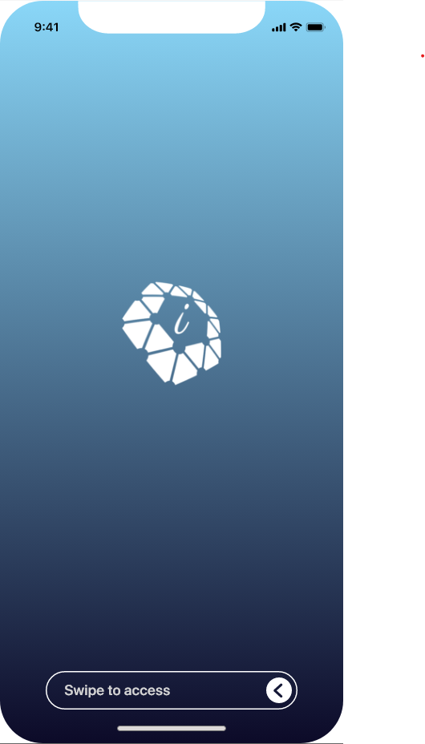
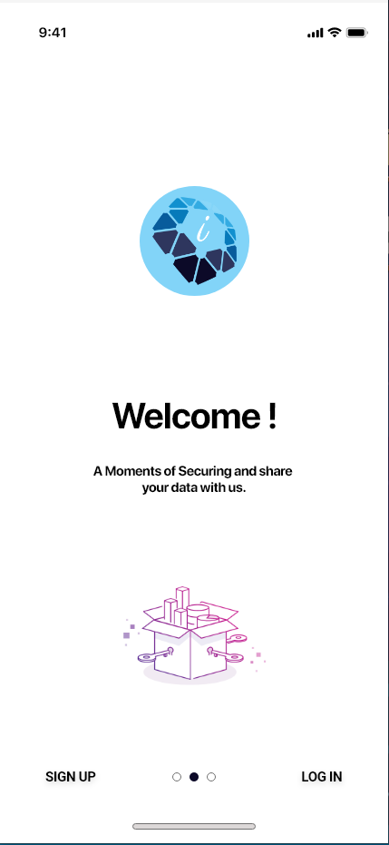
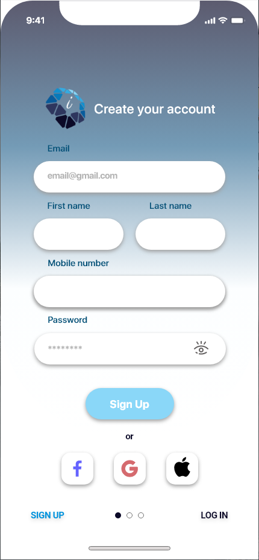
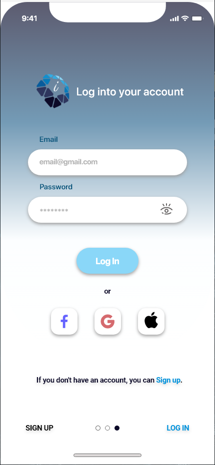
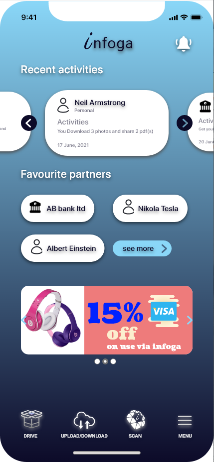
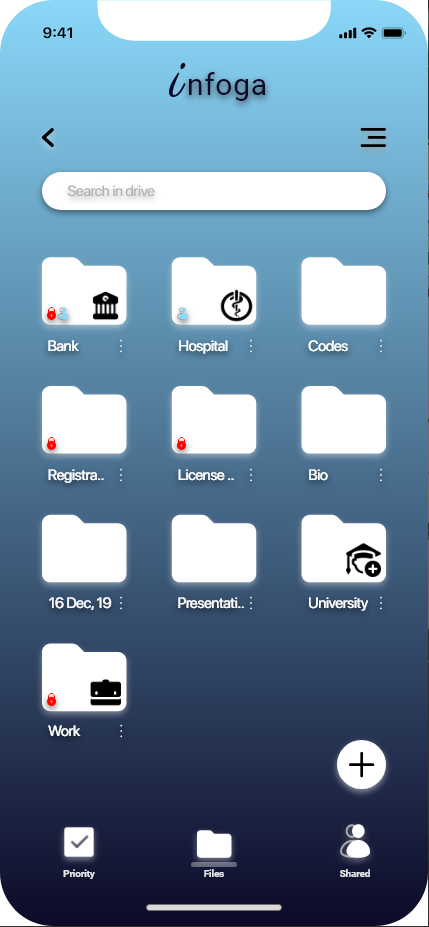
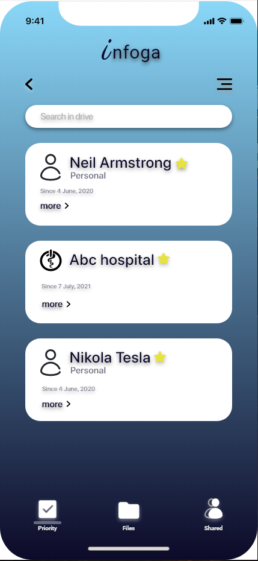
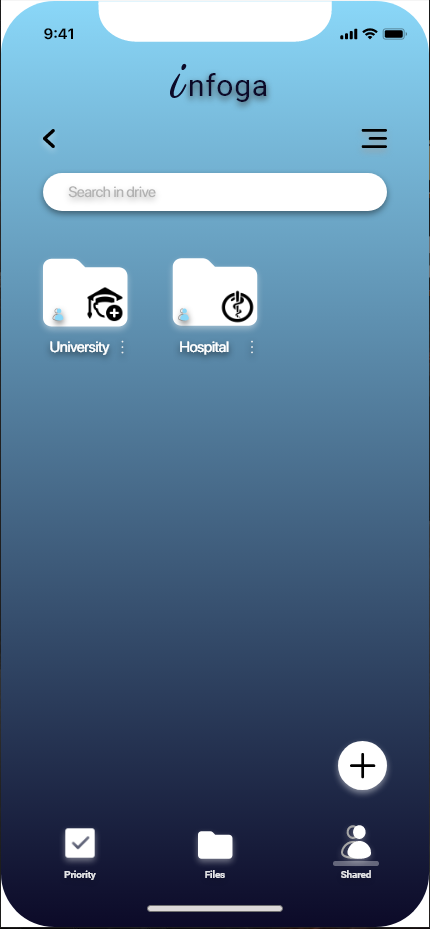
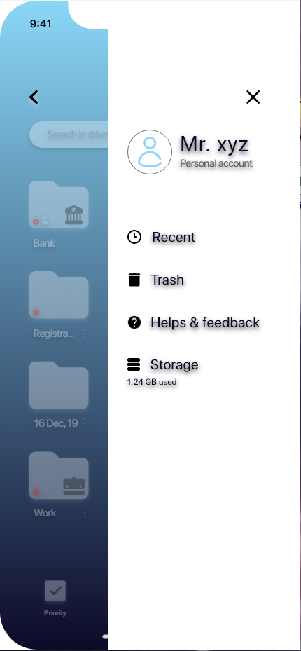

<h1 align="center">Infiga UI design</h1>

## Table of Contents

- [About](#about)
- [How to Run](#how-to-run)
- [Screenshots](#screenshots)
  - [Splash page](#splash-page)
  - [Welcome page](#welcome-page)
  - [SignUp page](#signup-page)
  - [Login page](#login-page)
  - [landing page](#landing-page)
  - [Others pages](#others-pages)
- [Contact](#contact)

## About
- It is a UI design of an application named "Infoga"
- Purpose of the application
  - It is designed for sharing data from your Mobile device via NFC. One user can share his or her information with another user easily and safely. This information can be store in the drive and separated for various uses. 

## How to Run
  - Install Adobe XD in your system.
    - To install Adobe XD, follow the [Adobe XD Page](adobe.com/creativecloud/plans.html?promoid=WXYGHWCC&mv=other).
  - Clone the project from my repository.
    - For the Cloning repository, follow the [GitHub Page](https://docs.github.com/en/repositories/creating-and-managing-repositories/cloning-a-repository)
  - Open the XD file in Adobe XD and enjoy.

## Screenshots
  ### Splash page

  ### Welcome page

  ### SignUp page

  ### Login page

  ### landing page

  ### Others pages

## Contact
- GitHub [@riyad959](https://github.com/riyad959)
